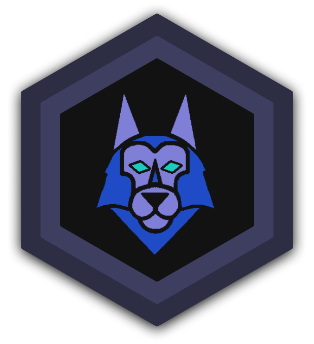

<h1 align="center">Sentinel</h1>

</img>

<h2>Idea Fruition</h2>
Sentinel is the solution to a problem all of us could relate with, which was the fact that we have all experienced either being lost at a young age or have had members of our family be lost as well. This is how our idea was born and then we went and coded it to reality. Due to the nature of how we wanted the app to be used, we decided to challenge ourselves and grow more skills by making our first React Native mobile app.
<h2>Use Case</h2>
At first we thought this would be a great tool for parents to keep track of their children since most children have cell phones. Ultimately, our perspective changed when we realized the potential that the app could have with businesses as well. A company who has a fleet of vehicles with employees who drive around the city or states, can keep track of their vehicle locations. It can be used by anyone at a theme park, concert, and any place where there is potential of getting separated.
<h3>Team</h3>
- Emir Velazquez, Front End and App Design <a href="https://github.com/EmirVelazquez"></img></a>